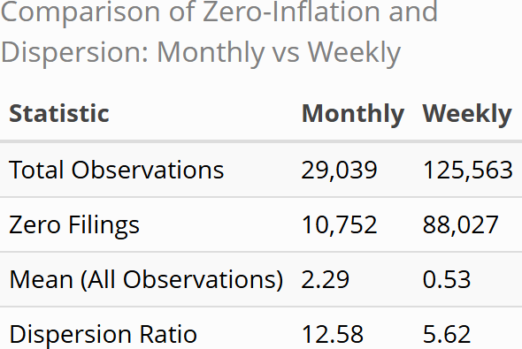
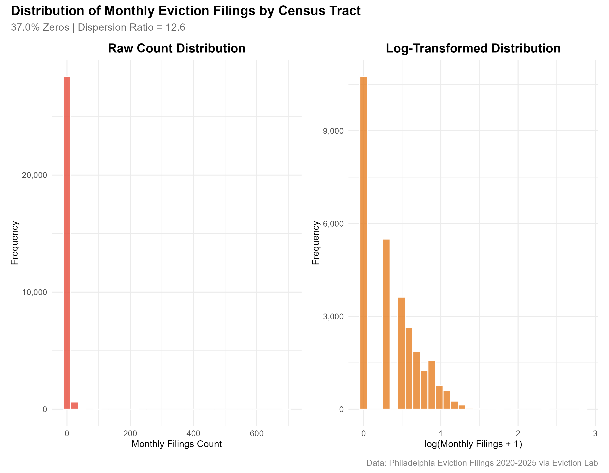
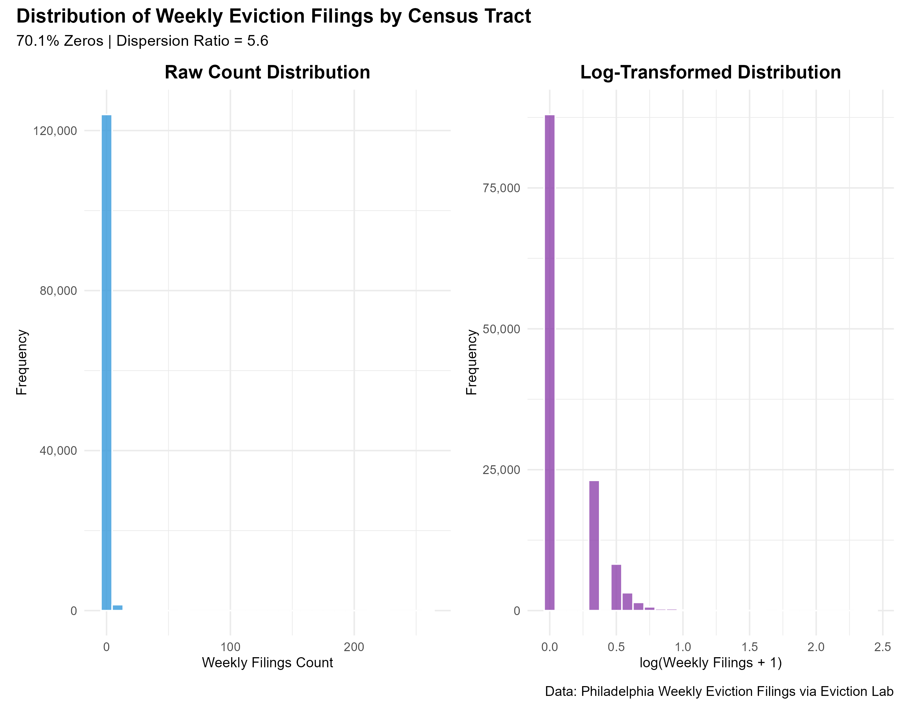

---

### Contents
- The Problem
- Methods
- Results and Model Performance
- Limitations
- Recommendations for implementation

---

### Research Question

Where should renter's assistance programs be?

---

### Philadelphia Context

- 331,415 renter households
- Notice Periods
    - Non-payment of rent: 10-days
    - Lease of one year or less: 15-day
    - Leases longer than a year: 30-day
- Emergency Rental Assistance Program (ERAP) program ended in September
- New protections went into effect in December 

---

### Monthly Eviction Trends

{fig-align="center"}

---

### Data Sources:

- Census ACS (American Community Survey, 2022)  

- OpenDataPhilly  
  - Claims 
  
  - Real Estate Tax Balances
   
  - Crime Incidents: Citywide crime incident reports
  
---

### Cleaning Data

- **Tax Delinquincy Data**: Removed 8 Overdue Properties

- **Monthly Census Data**: Sealed data introduces outlies of mass evictions

---

### Exploratory Data Analysis

{fig-align="center"}

**Excess amount of zeros**

---

### Methods: Monthly Eviction Filings

{fig-align="center"}

The overdispersion violates the Poisson assumption of equal mean and variance which justifies using Negative Binomial regression over Poisson regression.

---

### Methods: Weekly Eviction Filings

{fig-align="center"}

The weekly distribution is severely zero-inflated, which the Negative Binomial Regression model cannot handle.

---

### Analysis of Additional Data Sources

---

### Model Performance

---

### Limitations

- Limited toolkit: Cannot use Zero-Inflated Negative Binomial model
- Accounting for mass evictions

---

### Recommendations for Implementation

---

