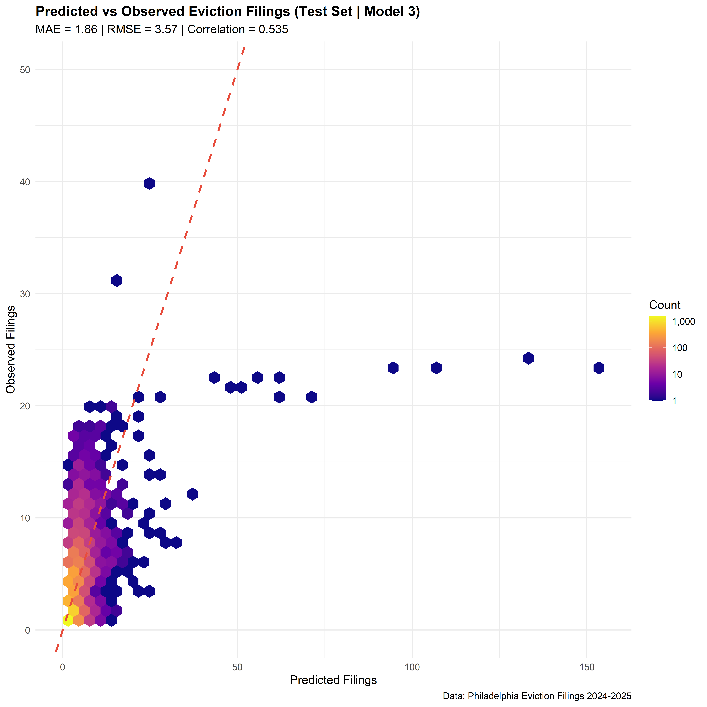
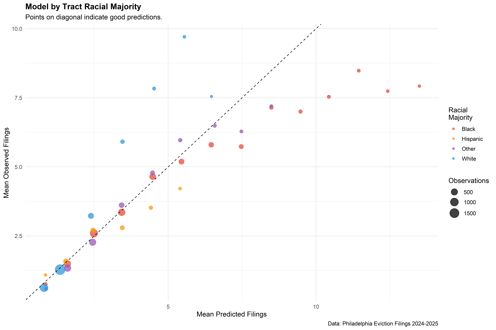

---

### Contents

**1.** The Problem  
**2.** Methods  
**3.** Results & Model Performance  
**4.** Limitations  
**5.** Recommendations

---

### Research Question

 

Where should renter's assistance programs be targeted in Philadelphia?

  

---

### Philadelphia Context

331,415 Philadelphia households are renters. The eviction notice timeline ranges are: 10 (no rent payments), 15 days for a lease less than a year and 30 days for a lease greater than a year. 

{width="150%" fig-align="center"}

---

### Philadelphia Context: Policy Updates

The Emergency Rental Assistance Program (ERAP) ended (Sept 2025).

{fig-align="center"}

---

### Monthly Eviction Trends

{fig-align="center"}

---

### Data Sources:

- Census ACS (American Community Survey, 2022)  

- OpenDataPhilly  
  - Claims 
  
  - Real Estate Tax Balances
   
  - Crime Incidents: Citywide crime incident reports
  
---

### Cleaning Data

- **Tax Delinquincy Data**: Removed 8 Overdue Properties

- **Monthly Census Data**: Sealed data introduces outlies of mass evictions

---

### Exploratory Data Analysis

 
{width="800" fig-align="center"}
  

**Excess amount of zeros**

---

### Methods: Monthly Eviction Filings

{fig-align="center"}

The overdispersion violates the Poisson assumption of equal mean and variance which justifies using Negative Binomial regression over Poisson regression.

---

### Methods: Weekly Eviction Filings

{fig-align="center"}

The weekly distribution is severely zero-inflated, which the Negative Binomial Regression model cannot handle.

---

### Analysis of Additional Data Sources

{fig-align="center"}

---

### Best Predictors

{fig-align="center"}

---

### Model Performance

{fig-align="center"}

---

### Evaluation of Model

{fig-align="center"}

---

### Limitations

- Limited toolkit: Cannot use Zero-Inflated Negative Binomial model
- Accounting for mass evictions
- racial inequity 

---

### Limitations: Less accuracy in majority black tracts

{fig-align="center"}

---

### Recommendations for Implementation

