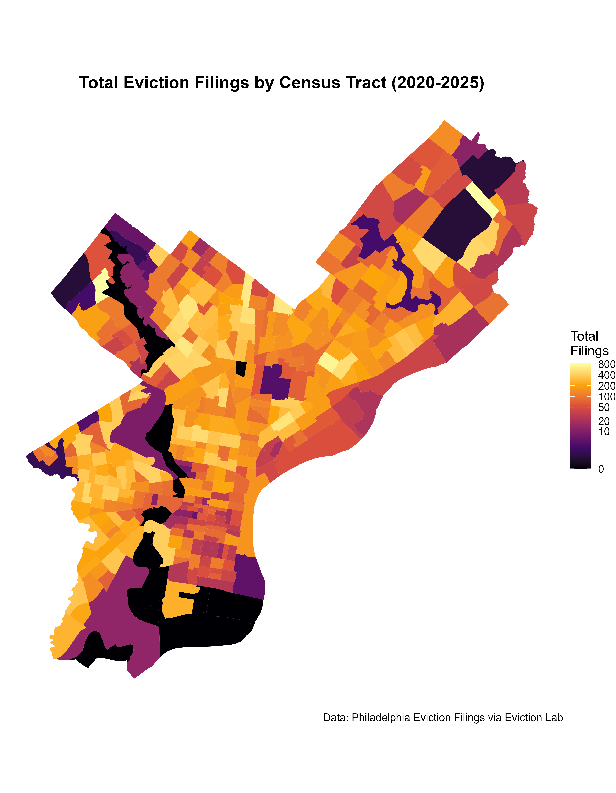
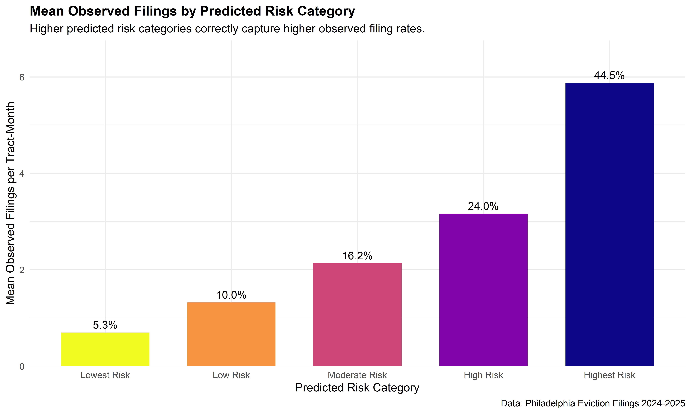
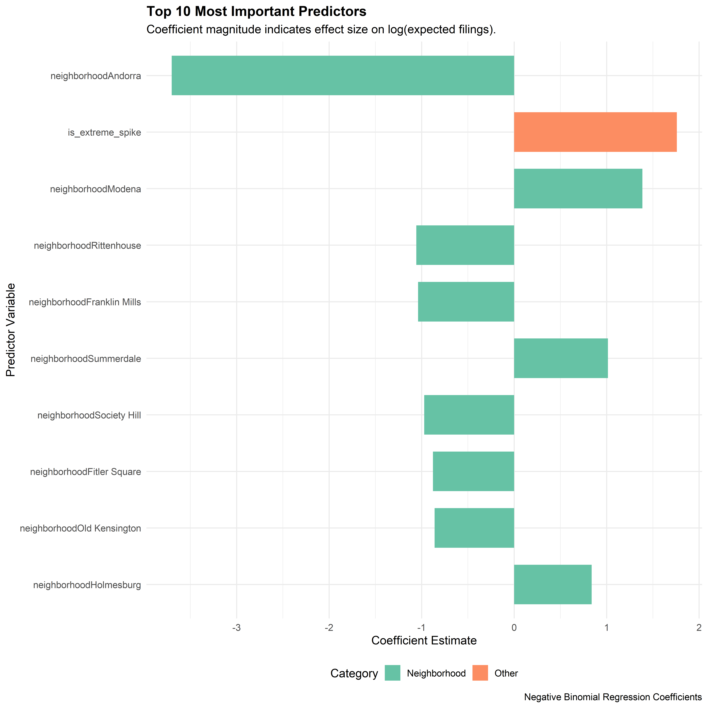
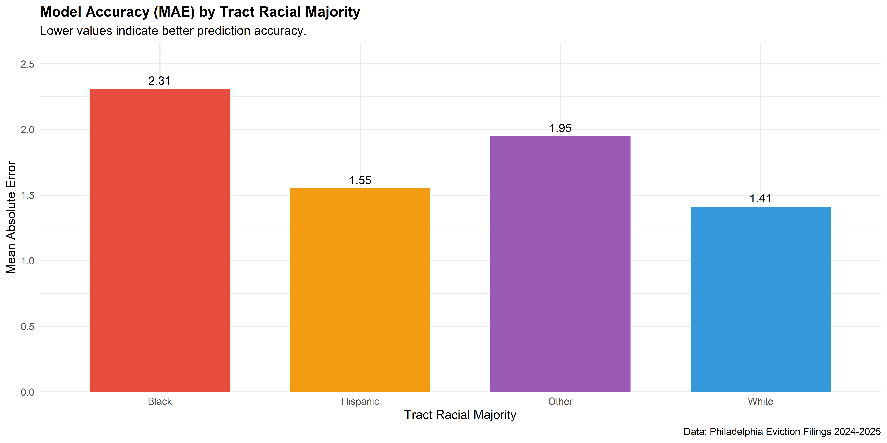

## The Crisis: Eviction Moves Faster Than Policy {background-color="#2C3E50"}

::: {.columns}
::: {.column width="60%"}

:::
::: {.column width="40%"}
### The Status Quo
City responses are **reactive**. Resources deploy *after* filings surge.

### The Stake
**331,415** renter households.
Eviction is a cause and consequence of poverty that destabilizes entire blocks.

### The Goal
Build a tool that gives the Office of Homeless Services a **one-month head start**.
:::
:::

## The Context: A Volatile Landscape

* **The Shock:** COVID-19 Moratorium (2020-2021) suppressed filings by **~50%**.
* **The Rebound:** Filings are rising again, but the recovery is **"K-shaped"** and unequal.
* **The Challenge:** Volatility makes simple trend forecasting impossible. We need a structural model.

## The Solution: A Spatio-Temporal Risk Engine

::: {.panel-tabset}

### Input Data
We integrated **dynamic** and **structural** data sources:

1.  **Momentum:** Past filing history (Lagged).
2.  **Contagion:** Neighboring tract filings (Spatial Lag).
3.  **Distress:** Tax Delinquency & Median Claim Amount.
4.  **Structure:** Poverty Rate, Rent Burden, Single-Parent Households.

### Methodology
**Negative Binomial Regression (Count Model)**

* **Why?** Eviction data is "Overdispersed" (Variance $\gg$ Mean).
* **Strategy:** We trained on the chaotic 2020–2023 period but validated on the "New Normal" of 2024–2025 to prove robustness.
* **Innovation:** We capped extreme outliers in training to stabilize the model, while testing against real-world mass displacement events.

:::

## Does It Work? Model Performance

::: {.columns}
::: {.column width="50%"}
### Accuracy
* **MAE:** **1.85** filings/month.
* **Result:** Our model is accurate to within **< 2 filings** per tract.

### Validating Risk
We don't just count; we **triage**.
Tracts flagged as **"Critical Risk"** saw **5x more evictions** than those flagged as "Low Risk."
:::
::: {.column width="50%"}

:::
:::

## Key Drivers of Eviction Risk

* **Momentum (Inertia):** The strongest predictor. Eviction is "sticky."
* **Policy Impact:** The Moratorium reduced filings by **45%**.
* **Structural Vulnerability:** Single-mother households and tax delinquency are significant risk multipliers.

## Critical Analysis: Equity & Ethics {background-color="#E74C3C"}

::: {.columns}
::: {.column width="50%"}

:::
::: {.column width="50%"}
### The Finding
**Disparate Impact.**
Black-majority tracts face a structurally higher baseline risk that standard economic variables cannot fully explain.

### The Safeguard
This tool must be used for **Resource Addition** (targeting aid), never for **Resource Withdrawal** (redlining).
:::
:::

## Implementation: The "Triage Dashboard"

### Operational Plan for Office of Homeless Services

1.  **Run Model (Monthly):** Input last month's data on the 1st.
2.  **Generate List:** Output the **Top 50 "Critical" Tracts**.
3.  **Deploy Resources:**
    * **Canvassing:** Send teams to these 50 tracts *before* court dates.
    * **Direct Mail:** Target "Know Your Rights" flyers.
    * **Coordination:** Alert local CDCs to expect volume.

## Conclusion

> "This model turns data into defense. By identifying structural vulnerability one month in advance, we move from counting evictions to preventing them."

**Thank You.**